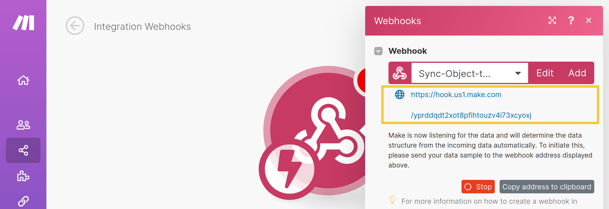
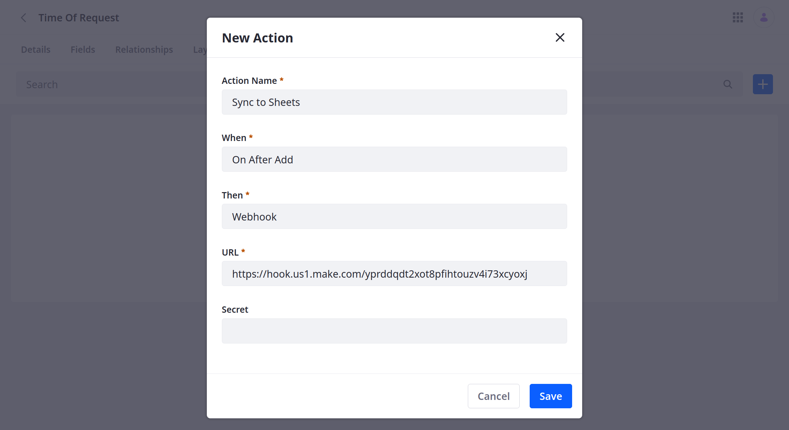
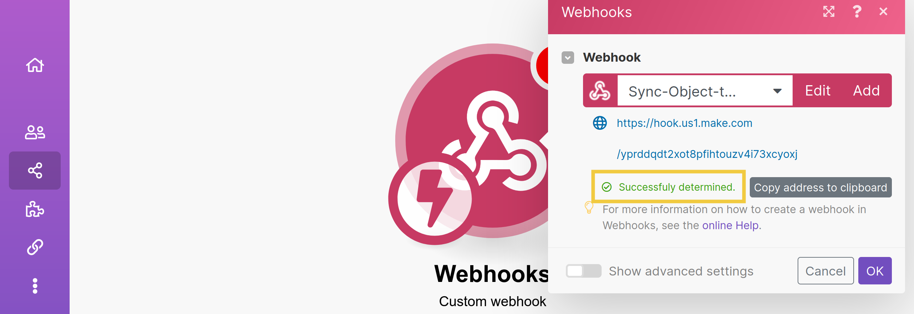
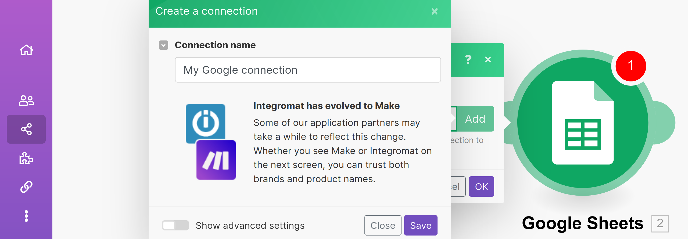
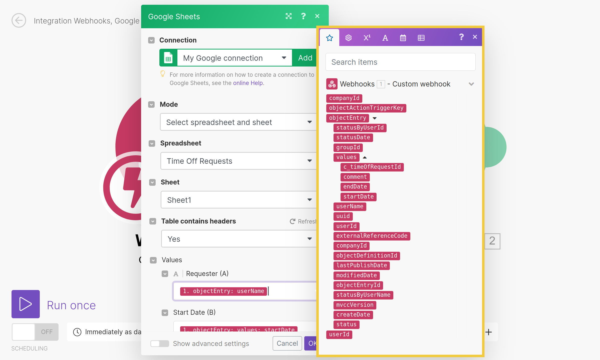
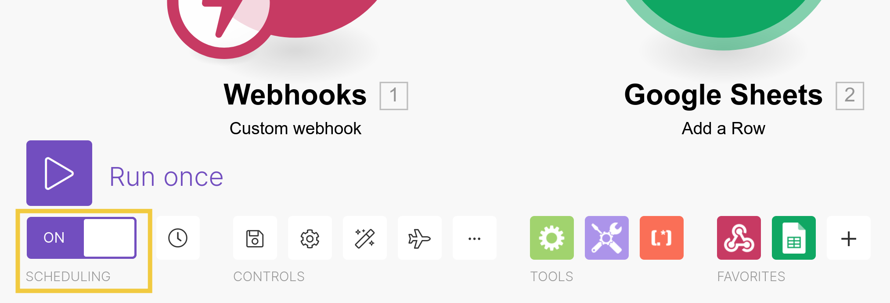
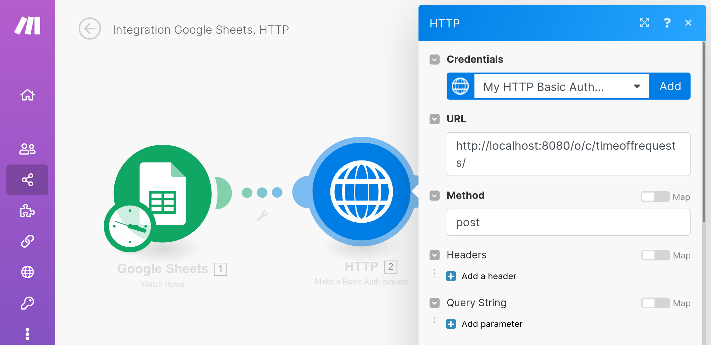
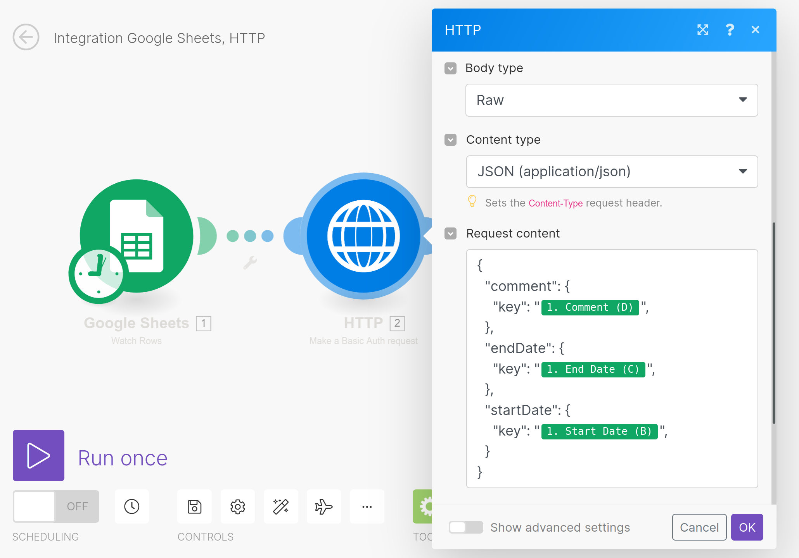
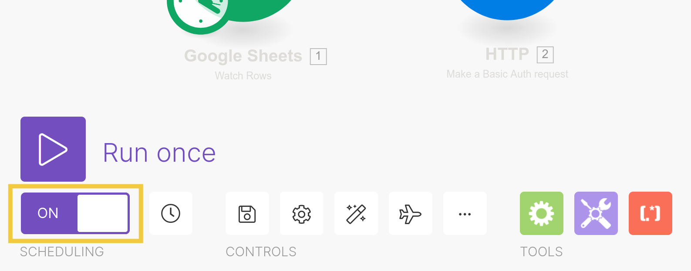

# Using Integromat to Sync Object Data with Google Sheets

________

Syncing your data in this way requires an Integromat account, Google Spreadsheet, and active DXP 7.4 instance. The DXP instance must also have a published Object with the desired fields for sending or receiving data to the Google Spreadsheet.

<!-- The following examples __... -->

## Syncing Object Data to a Google Sheet

Follow these steps to sync Object data to a Google Sheet:

1. Open Integromat, navigate to the *Scenarios* page, and click *Create a new scenario*.

   

1. Click the *Add* button, select the *Webhooks* module, and choose the *Custom webhook* trigger. <!--This runs the scenario when the webhook receives data.-->

   

   

1. Select the new module and click *Add* to generate a new webhook.

   

1. Once created, copy the generated *webhook URL*.

   

1. Use the copied URL to [define an Object action](../creating-and-managing-objects/defining-object-actions.md) that sends a request to the webhook endpoint whenever a new Object entry is added.

   

1. Trigger the webhook by adding a test entry to the Object.

   This allows the Webhooks module to determine the Object's data structure automatically.

1. Verify the module has successfully determined the Object's data structure and click *OK*.

   

   ```{note}
   If the Object's structure changes, return to editing the Webhooks module and click *Redetermine data structure*.
   ```

1. Click the *Add new module* button, select the *Google Sheets* module, and choose the *Add a row* action.

   

   

1. Select the new module and click *Add* to connect a Google account.

1. Enter a connection name and click *Save*.

   This opens a window for selecting the desired Google account and granting Integromat permission to access the account's files.

   

   After granting integromat permission, return to editing the Google Sheets module.

1. Determine the module's mode and then select the desired *Spreadsheet* and *Sheet* to sync with the Object.

1. Indicate whether the selected Sheet includes headers.

1. Map the Sheet's columns to data fields in the Object's structure. Available Object fields are provided by the *Webhooks* module.

   

1. Turn on *scheduling* and *save* the scenario.

   

Once saved, new Object entry data is added to the selected Sheet.

## Syncing Sheet Data to an Object

Follow these steps to sync Google Sheet data to an Object:

1. Open Integormat, navigate to the Scenarios Page, and click *Create a new scenario*.

   

1. Click the *Add* button, select the *Google Sheets* module, and choose the *Watch rows* trigger. <!--This sets the module to watch for new rows in a Sheet.-->

   

   

1. Select the new module and click *Add* to connect a Google account.

1. Enter a connection name, click *Save*.

   This opens a window for selecting the desired Google account and granting Integromat permission to access the account's files.

   

1. Select the desired *Spreadsheet* and *Sheet*.

1. Indicate whether the selected Sheet includes headers and enter the range of columns to watch (e.g., `A1:E1` sends data input on columns A through E.).

1. Set the limit of results to be worked with during one execution cycle.

1. Click *OK* when finished.<!--prompted to determine when to start...-->

1. Click the *Add new module* button, select the *HTTP* module, and choose the *Make a Basic Auth request* action.

   

   

   ```{important}
   Basic authentication is used for demonstration purposes only. Use a more secure authentication method for business use cases (e.g., *Make an OAuth 2.0 request*).
   ```

1. Select the new module and click *Add* to add basic authentication credentials.

1. Once added, enter the Object's Headless API URL, which uses this format: `https://<your-domain>/o/c/<objectname>/`. See [Headless Framework Integration](../understanding-object-integrations/headless-framework-integration.md) for more information.

1. Select the *post* method type.

   

1. Select the desired body type (e.g., *RAW*) and content type for the request (e.g., *JSON*).

1. Enter the request body using the appropriate formatting for the selected content type and target Object.

   

1. Click *OK*.

1. Turn on *scheduling* and *save* the scenario.

   

   ```{note}
   By default this scenario is automatically triggered every 15 minutes. 
   ```

## Additional Information

* [Objects Overview](../../objects.md)
* [Creating and Managing Objects](../creating-and-managing-objects.md)
* [Understanding Object Integrations](../understanding-object-integrations.md)
