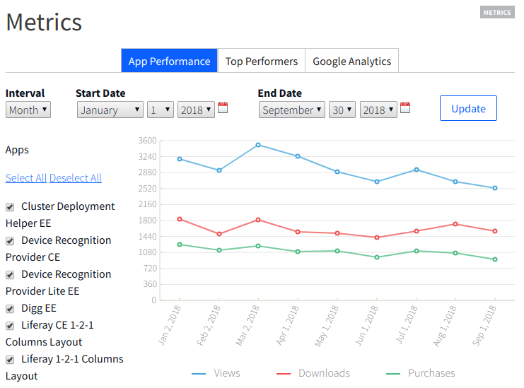

# Tracking App Performance

One of the main reasons for developing and publishing apps on Marketplace is to drive app downloads and adoption. Marketplace gives you detailed reports on views, downloads, and purchases of your app(s). To access these metrics, navigate to Account Home → Metrics (under Development).

The view shown above is the default metrics view for a developer’s apps. Across the bottom is a list of data series options (Views, Downloads, or Purchases). At the top, you set a date range. In the middle, a graph shows the data within the date range. Finally, the graphed data is also shown in tabular format, in case you want to know the exact values making up the graph. The different types of data available to view are described below.

## Views

When someone searches or browses the Marketplace, they click on apps to see their details. When this occurs for an app, Marketplace records a View for it. When you select Views in the App Metrics screen, the app view count over time appears. The App Metrics screen shows Views by default. The number of possible views per day per user is unlimited.

## Downloads

Marketplace records a Download for your app when someone downloads any package of any version of your app. The number of possible downloads per day per user is unlimited.

## Purchases

The Marketplace counts app purchases too.

As you see areas to improve your app or when necessary changes come up, you can make changes to your published app. The next article describes changes you can make.