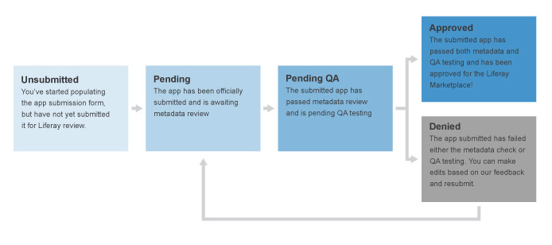

# Understanding the App Review Process

The Liferay Marketplace app QA/review process begins as soon as you submit your app for review. Every third-party app submitted to the Liferay Marketplace is reviewed by our team to ensure that certain standards for information are upheld and the app installs as expected. Liferay cannot, however, be a substitute for your own testing and debugging team. Ultimately, you must test, refine, and ensure that your app functions as promised and performs as expected.

```{note}
Liferay is not responsible for the behavior (or misbehavior) of apps on the Marketplace. For details regarding this, consult the Liferay Marketplace User Agreement, Liferay Marketplace Developer Agreement, and the individual End User License Agreements associated with each app.
```

Once you’ve submitted your app for review, your app’s status changes as it moves through the review process. We email you on status changes and provide as much detail as we can if we discover potential issues with your app. Overall, we don’t want our app review process to feel like a barrier or a black box. We love having new apps in the Marketplace, and we try to be as helpful as we can throughout the approval process.



If you submit an updated version of a previously approved app, you’ll see these statuses: Approved (Version Unsubmitted), Approved (Version Pending), Approved (Version Pending QA), and Approved (Version Denied).

The app review process consists of *Two Major Phases*:

| Review Phase | Est. Time Frame |
| --- | --- |
| **App metadata review** - Our team reviews your app's metadata to confirm that titles, descriptions, images, etc. are appropriate. | ~1 week |
| **App QA test** - Liferay ensures that apps meet a minimal set of requirements: 1. Passes anti-virus scan 2. Deploys successfully on standard Liferay supported environments/platforms without errors 3. Basic functionality "smoke" test. Liferay does not do source code review and does not ask for your source code. Further, Liferay is not responsible for the behavior (or misbehavior) of apps on the Marketplace. Please consult the Liferay Marketplace User Agreement, Liferay Marketplace Developer Agreement, and the individual End User License Agreements associated with each app. | ~1-2 weeks |

*Our QA Test Environments* are summarized below. At a minimum, test your app against these environments prior to submission. If technical reasons prevent your app from running on certain platforms (e.g., app server-specific issues), specify compatibility in the app description and documentation so that our review team can exclude certain test conditions, if necessary.

| Liferay Version| 6.x | 7.0.x | 7.1.x | 7.2.x |
| :--- | :----: | :----: | :---: | :----: | 
| **Operating Systems** | Ubuntu 11x and Windows 10 x64 | Ubuntu 11x and Windows 10 x64 | Ubuntu 11x and Windows 10 x64 | Ubuntu 11x and Windows 10 x64 |
| **Database** | MySQL 5.5.x | MySQL 5.6.x | MySQL 5.7.x | 
| **Application Server***| Tomcat 7 | Tomcat 8 | Tomcat 9 |  
| **JDK** | Oracle JDK 6, 7 | Oracle JDK 8 |
| **Browser** | Chrome | Chrome | Chrome | Chrome | 

```{note}
 "*" - You can request certification on additional, optional application servers. For Liferay 7.x, Wildfly 10 is available. For Liferay 6.x, Glassfish 3.1 and an appropriate JBoss version are available. Please add the request in the app submission panel’s Note to testers section.
```

Once your app is approved by Marketplace staff, you’ll get email notification. When your app is approved, it is made available on Marketplace. The app also appears on your public Profile page, which lists all apps that you or your company developed and published.

If your app is rejected, you receive an email explaining the reasons for rejection. You can then make the requested changes and re-submit the app for approval.

After you’ve successfully published your app, you might get all kinds of feedback from users and yourself about what’s right and wrong with it. The next article explores how to make changes once you have published your app.