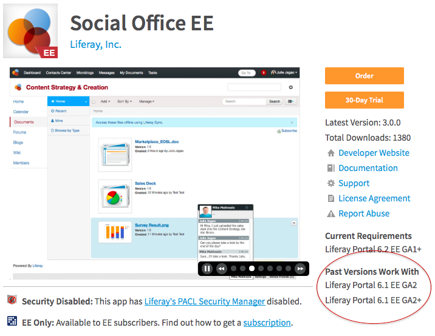
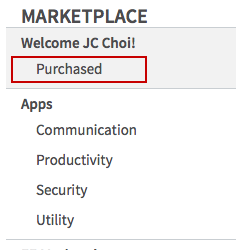
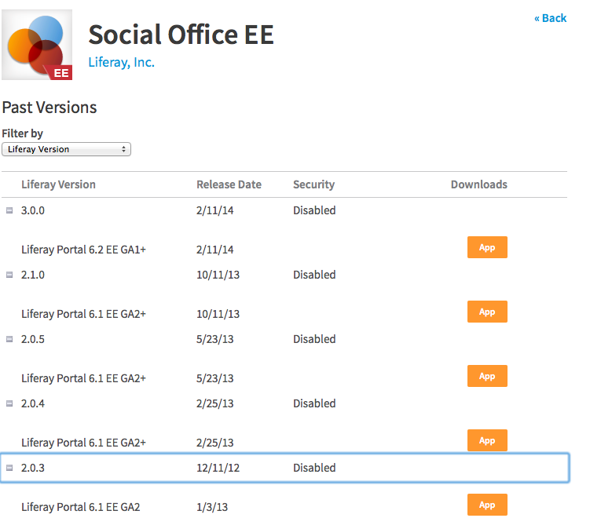

# Frequently Asked Questions

Get answers to the most frequently asked questions.
 
##  What is a Liferay App? 

Liferay apps are packages of "plug-ins" (portlet, hook, theme, etc.) that you can install into a Liferay portal installation to modify or extend Liferay's out-of-the-box functionalities. Some apps, like Liferay's Social Office, are developed, tested, and supported by Liferay. Third-party apps are developed, tested, and supported (if subscription services are offered) by other members of the broader Liferay community. Many official Liferay apps, as well as some third-party apps, are available free of charge. Other apps require you to pay a fee in order to access them and/or associated subscription services. 

## What is an Instance Unit?  

An Instance Unit is a unit of measure used to define pricing for certain Liferay Marketplace apps. An Instance Unit refers to a single installation of the Liferay Portal, which corresponds to one (1) Liferay Portal .WAR file.

## Are Liferay Apps Fully Tested?  

Official Liferay apps (developed, tested, and supported by Liferay) go through the same level of coding and testing rigor that Liferay Portal goes through. Every third-party app submitted to the Liferay Marketplace is reviewed by our team to ensure that certain standards for information are upheld and the app installs as expected. However, we cannot actively monitor nor guarantee the content or functionality of any third-party app in the Marketplace. Also, any technical or support-related question related to a third-party app should be directed to the third-party app developer.

## How Do I Request a Refund?  

Generally, all app sales are considered to be final. However, we do believe that developers should stand by their products. If an app fails to do what it says it will do, first contact the developer through the support information provided in the app description page. We find that in many cases, constructive dialogue resolves the issue or clears up any misunderstanding. You can also check out the Marketplace Forum(Opens New Window) to see if your issue has been discussed. If you are unable to reach the developer after reasonable attempts, you can contact us using the Marketplace [Contact Form(Opens New Window)](https://www.liferay.com/pt/contact-us). We are only able to consider refund requests within 30 days of purchase date.

## How Do I Get Support for My App?  

Liferay apps designated as "EE" (Enterprise Edition) apps are supported for Liferay Portal Enterprise Edition subscribers. The type and level of support for EE apps will depend on the [Enterprise Edition subscription tier(Opens New Window)](https://www.liferay.com/pt/subscription-services). Support may or may not be offered for third-party apps. Please be sure to confirm whether or not the developer is offering support for a third-party app before purchasing it. For supported third-party apps, please use the "Support" link provided on the right-hand side of the app description page. An overview of the Marketplace support policy is given below.

## What are the Different Types of Support Offered with Third-party Apps?  

Third-party developers for the Marketplace have the option of offering or not offering subscription services with their apps. Subscription services consist of support, maintenance, and updates. Buyers should read the app description carefully to determine if the app offers subscription services that meet their support needs. Depending on how the third-party app is licensed, you may be offered the following options around subscription services: 

### If the App has a Perpetual License 

1. The developer may offer annually renewable subscription services, and it will be priced on a "per Instance Unit per year" basis. The first year of subscription services is included with a perpetual license. After that, the buyer will need to renew subscription services at the developer's price. Buyers will be entitled to support, maintenance, and updates as long as they continue to renew subscription services annually. 
1. The third-party developer may offer no subscription services with their app, and buyers will be entitled to only app updates if and when updates become available. 
 
### If the APP has a Non-Perpetual (Annual/Renewable) License 

1. The developer may offer annually renewable subscription services, which is built into the "per Instance Unit per year" price of the non-perpetual license. Buyers will be entitled to support, maintenance, and updates as long as they continue to renew their license annually.
1. The developer may opt not to offer subscription services, and buyers will be entitled to only app updates if and when updates become available, as long as they continue to have a valid non-perpetual license.
   
## Why Do You Ask for a Destination Address for Apps?  

When purchasing an app from the Marketplace, you will be required to provide a destination address. This is the primary location where you plan to download and install the purchased app. The destination address is used to calculate the sales tax and VAT amounts, if applicable. Additionally, Liferay uses the destination address, along with the billing address, to ensure that we comply with U.S. export control and sanctions laws.

## How Do I Deploy an App?  

There are two ways to install an app to Liferay Portal: 

### Installation through the Control Panel

This is the easiest and most efficent way to deploy apps to Liferay Portal. Using the Marketplace menu items in the Control Panel, you can search for, purchase/download, and hot-deploy apps directly to your local Liferay installation. Utilizing the Control Panel to manage your apps will also allow you receive update notifications and easily apply updates.

### Installation through Liferay.com

Using Liferay.com to download apps is especially useful in situations where you do not wish to deploy the app directly to your production environment, or in cases where the target Liferay installation is behind a corporate firewall or otherwise does not have direct online access to the Marketplace. You can browse for and purchase apps through [liferay.com/marketplace(Opens New Window)](https://web.liferay.com/marketplace) and then use your App Manager to download them. The downloaded file can then be hot-deployed to Liferay by copying it to Liferay's hot deploy directory.

If you are trying to install the Marketplace portlet or any other Marketplace app in a controlled environment with restricted Internet and/or database access, you can find detailed instructions in the Liferay Marketplace tutorial.

## What is the Difference Between a Liferay EE and CE App?  

Liferay CE apps are Community Edition apps which are available free of charge to anyone running Liferay Portal, with or without an Enterprise Subscription. EE apps are tested and supported by Liferay, and are only available with an Enterprise Subscription. The level of support provide for Liferay EE apps will depend on the customer's subscription tier level.

## What are "Projects" and "Companies" and How are They Used in the Marketplace?  

Projects are used for sharing your purchased apps with other members of your team. Each member of a project will be able to provision licenses and install apps associated to that project (as many as the purchased license permits). When purchasing an app, you would select or create the project you want to use to share the app. You can also add and manage members of that team. In short, projects are used by Marketplace consumers.

## Can You Explain the Different User Roles Available Within Projects and Companies?  

**Project Roles:** 
  
* User Admin - Has the ability to add other users to a given project 
*  Buyer - Has the ability to purchase apps from the Liferay Marketplace and associate it to the project. 
  
**Company Roles:** 

*  User Admin - Has the ability to add other users to a development team of a registered company. 
*  Developer - Has the ability to submit apps to the Liferay Marketplace and access app management features, such as transactions history and metrics.

## How Do Licenses Work on the Marketplace? 

Licenses are valid per app per project (individual basis or project basis). They cannot be transferred nor re-sold. Licenses permit a buyer to deploy an app on their system based on these specified parameters set by the developer: 

*  Standard or developer license 
*  Perpetual, non-perpetual (annual/renewable) or 30-day limited trial 
*  Allowed Instance Units

```{note}
An Instance Unit refers to a single installation of the Liferay Portal, which corresponds to one (1) Liferay Portal .WAR file
```

## What is the Difference Between a Standard and Developer License?  

Standard licenses allow unlimited connections. Liferay Portal Developer Licenses are limited to 5 users (including anonymous users). Marketplace App Developer Licenses are limited to 10 users. Developer licenses should not be used for production deployments.

## What Payment Forms are Accepted for App Purchases?

Marketplace apps can be purchased with a credit card via Paypal or you can request an invoice to be sent to a billing email address that you designate. For invoice request transactions, purchased apps will be available for download after payment is received.

## Will I Be Able to Purchase a Marketplace App on Behalf of a Client?  

Currently, you can only purchase a Marketplace app for yourself (personal use only) or for your own company (project basis). The ability to purchase apps for customers/clients is on our roadmap, and this will be one of the key things we're going to focus on for the next iteration of the Marketplace.

## How Do I Access Older Versions of an App? I'm Running a Previous Version of Liferay Portal – Is This App Compatible?  

The Liferay Marketplace will allow you to access and download all previous versions of an app that you've purchased – both free and paid apps. First, make sure that the app supports the Liferay Portal version that you're running prior to purchasing/downloading the app. The compatible Liferay Portal version for the latest version of the app, as well as compatible Portal versions for all previous versions of the app will be listed on the app details page on the Marketplace (Under "Past Versions Work With" on the right-hand side and also under the "Version History" tab at the bottom of the app details page).



Once you've purchased an app, you can go to your "Purchased Apps" page by clicking on "Purchased" under the Marketplace navigation on the left-hand side.



From here, click on the desired app, and then click on "Find Past Versions" which will list every available version you can download. If you don't see your app on the "Purchased Apps" page, please make sure that you've selected the right Project (under the "Select a Project" dropdown menu) that you designated during the purchase process.



## How can I get answers to more questions I have about distributing on Marketplace?  

Go to the [Marketplace Developer Forum](https://web.liferay.com/web/developer/marketplace/forums).

## How do I contact Liferay's Marketplace team?  

Go to the [Contact Marketplace](https://www.liferay.com/pt/contact-us) form and submit your request or question.