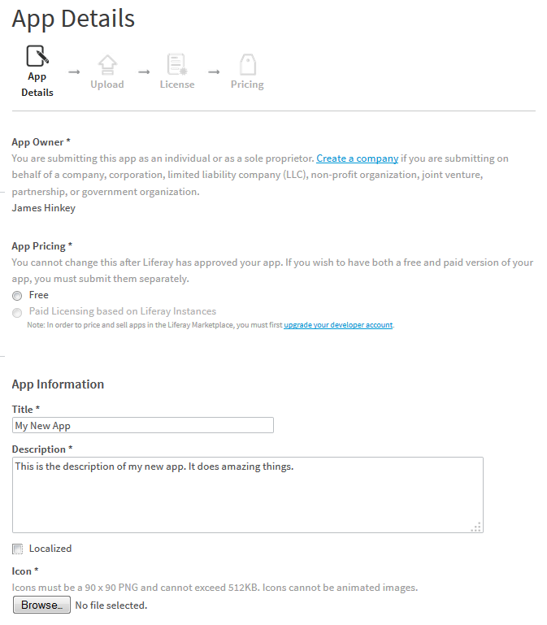

# Specifying Your App’s Initial Details

From this screen you enter your app’s basic details. Previous articles [Planning Your App’s Distribution](../planning-your-apps-distribution.md) and [Preparing Your App](../preparing-your-app.md) helped prepare you for filling in these details.

The top portion of the app wizard’s initial screen is shown in the figure below.



Here are descriptions of this screen’s fields:

* **App Owner**: Choose to whom the app “belongs” once it is uploaded–either yourself (personal) or a company. If you’d like to submit on behalf of a company, click Create a company to go to the Join A Company page. From this page, search to see if your company already exists in the Liferay Marketplace. If you wish to publish your app on behalf of your company, but your company does not yet have a Marketplace profile, register your company by clicking Register My Company, filling out the registration form, and submitting the form.
* **App Pricing**: Choose whether you want the app to be free or paid. If you choose paid, you’ll have the option to specify pricing and licensing details later in the submission process.

```{Important} 
You can’t change the app from free to paid or from paid to free once the app is published to the Marketplace. In order to offer the app in the other license type, you must submit another app under a different name (title). If you wish to have both free and paid licenses for your app, you must submit the app under one name for free licenses and submit it under another name for paid licenses. Make sure to select the license type (i.e., free or paid) that’s best for your app.
```
    
* **Title**: Name of your application.
* **Description**: Like the name says, this is a description of your app. You can put anything you want here, but a good guideline is no more than 4-5 paragraphs. This field does not allow any markup tags or other textual adornments–it’s just text.
* **Localized**: Selecting this displays an Add Translation button that lets you denote translations your app provides.
* **Icon**: Upload an icon image to represent your app.
* **Screen Captures**: Upload one or more screenshots of your app. The screenshots you upload here are displayed in a carousel of rotating images when your app is viewed on the Marketplace.
* **Category**: Choose the Marketplace category that most accurately describes what your app does. Users looking for specific types of apps often browse categories by clicking on a specific category name in the main Marketplace home page. Having your app listed under the appropriate category helps them find your app.
* **Developer Website URL**: This is a URL that should reference the web site associated with the development of the app. For open source apps, this typically points at the project site where the source is maintained. For others, links to a home page of information about this app would be appropriate.
* **Support URL**: This is a URL that should reference a location where your app’s purchasers or users can get support.
* **Documentation URL**: What better way to showcase the amazing capabilities of your app than to have a live, running version of it for potential buyers to see and use? This field can house a URL pointing to something as exciting as that and/or documentation for using your app.
* **API Reference URL**: This is a URL that should reference your app’s API documentation (e.g., Javadoc).
* **Source Code URL**: If you’d to provide a link to the source code of your app, do so here.
* **Labs**: You can denote an app as experimental by checking the appropriate box.
* **Security**: If your app is only for Liferay 7.0 or later, or does not contain WAR-style plugins, or does not use Liferay’s PACL Security Manager, check the appropriate box. Otherwise, enable the security manager in your app by including the setting `security-manager-enabled=true` in the [liferay-plugin-package.properties](https://docs.liferay.com/portal/6.2/propertiesdoc/liferay-plugin-package_6_2_0.properties.html) file in your plugin WAR files.
* **Tags**: A set of descriptive words that categorize your app. These tags are free-form and can help potential purchasers find your app through keyword searches, tag clouds, and other search mechanisms. You can click on Suggestions to let Marketplace suggest some tags for you based on the data you’ve already entered. Click Select to select from existing tags, or you can manually type in new tags.
* **EULA**: You can use the default end user license agreement (EULA) or provide your own. There’s a link to the minimum terms which custom EULAs must satisfy.

Remember to visit the articles Planning Your App’s Distribution and Preparing Your App for information to help you decide how best to fill in many of these fields.

Once you’ve entered all your app’s details, click Next to get to the screen for uploading your app’s files.

