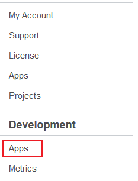

# Submitting Your App

```{toctree}
:maxdepth: 3

submitting-your-app/specifying-your-apps-initial-details.md
submitting-your-app/uploading-your-app.md
submitting-your-app/creating-your-licensing-and-pricing-model.md
submitting-your-app/submitting-your-app-for-review.md

```

Now that you have everything in order for publishing your app, you can start the Marketplace app submission process.

Go to your Account Home on [liferay.com](https://www.liferay.com/pt/home). In the left side navigation panel of your profile page, there are links to pages related to using apps and developing apps. Links to Apps and Metrics appear in the Development section of the navigation panel. You’ll use these links heavily during development, so you may want to bookmark this page too. Click Apps from the Development section to access your app development page.



Now that you know how to get to your app development page, you can submit your app! It involves,

* [Specifying your app’s initial details](./submitting-your-app/specifying-your-apps-initial-details.md)
* [Uploading your app](./submitting-your-app/uploading-your-app.md)
* [Creating your licensing and pricing model](./submitting-your-app/creating-your-licensing-and-pricing-model.md)
* [Submitting your App for Review](./submitting-your-app/submitting-your-app-for-review.md)

To begin the process of publishing your app, click Add New App. The app wizard appears, so that you can fill in your app’s details.