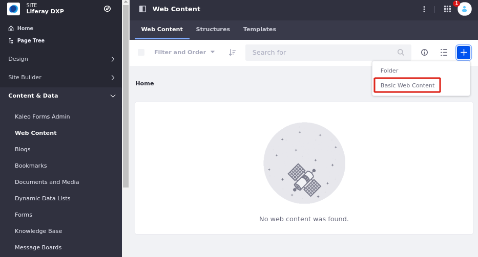
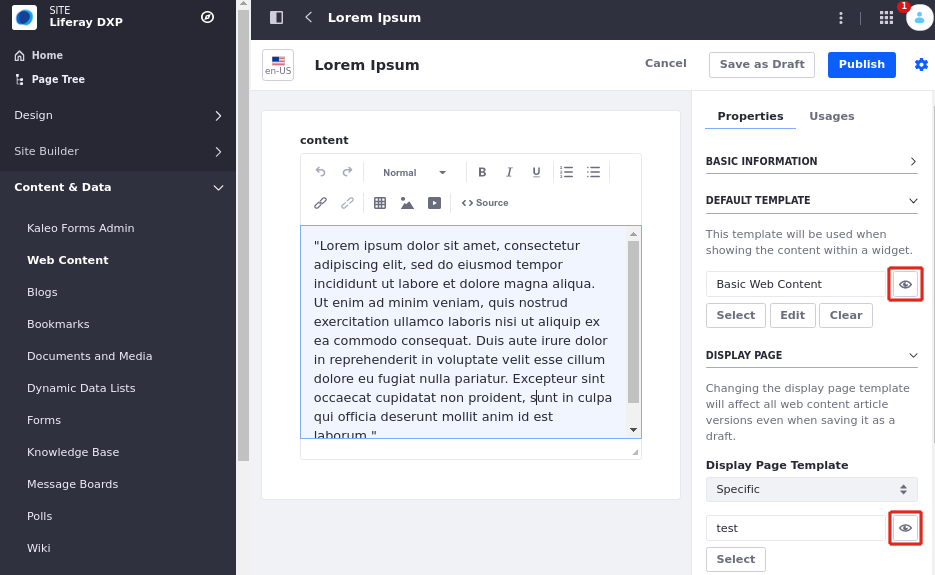

# Adding a Basic Web Content Article

Web content is one of the most practical and essential methods for creating site content. Web content articles can be displayed through [widgets](../../../site-building/displaying-content/additional-content-display-options/using-the-web-content-display-widget.md), [Fragments](../../../site-building/displaying-content/using_fragments.html), or [display pages](../../../site-building/displaying-content/using-display-page-templates/creating-and-managing-display-page-templates.md).

Each web content article is based on a structure that defines its available fields. Liferay includes the _Basic Web Content_ structure out-of-the-box, but you can create your own. See [Understanding Web Content Structures](../web-content-structures/understanding-web-content-structures.md) for more information.

## Creating a Basic Web Content Article

1. Open the Site Menu (), and navigate to _Content & Data_ → _Web Content_.

1. Click on the *Add* button () and select _Basic Web Content_.

    .

1. Enter a *title* (required) for the new article and add the desired *content* to their respective fields.

    

1. (Optional) Click on _Preview_ () to verify your content from Default Template and Display Page Template.

     

1. When finished, click _Publish_.

Congratulations! You have added a basic web content article to your Site. See [Using the Web Content Display Widget](../../../site-building/displaying-content/additional-content-display-options/using-the-web-content-display-widget.md) for more information on displaying this article on a page.

## Properties Tab

When creating or editing a _Basic Web Content_ article, you can access the following options via the _Properties_ tab in the sidebar menu:

| **Property** | **Purpose** | **Additional Notes** |
| --- | --- | --- |
| **Basic Information** | Displays the structure the web content is based on, and a Summary field where you can enter a short description. | The structure cannot be edited once the article is created. See [Web Content Structures](../web-content-structures/understanding-web-content-structures.md) for more information. |
| **Default Template** | Used to select which template to use to display this web content, by default. | See [Adding Web Content Templates](../web-content-templates/creating-web-content-templates.md) for more information. |
| **Display Page Template** | Used to select a Display Page Template for this article, if one is desired. | See [Creating and Managing Display Page Templates](../../../site-building/displaying-content/using-display-page-templates/creating-and-managing-display-page-templates.md) for more information. |
| **Featured Image** | Used to select a small image to use as the article's thumbnail. | The image can come from a URL or uploaded from your system. |
| **Metadata** | Used to set any tags or priority for the article. | See [Tagging Content](../../tags_and_categories.html) for more information. |
| **Friendly URL** | Used to set a custom friendly URL for this article. | |
| **Schedule** | Used to schedule a date to display or expire the article, if desired. | See [Scheduling Web Content](https://help.liferay.com/hc/en-us/articles/360029042011-Scheduling-Web-Content-Publication) for more information. |
| **Search** | Used to set whether this article will be indexed for search. | |
| **Related Assets** | Used to select any related assets, if desired. | |
| **Permissions** | Used to set any permissions for Guests or Site Members, specific to the article. | Click More Options to see who can view the article. See [Roles and Permissions](../../../users-and-permissions/roles-and-permissions/understanding-roles-and-permissions.md) for more information. |

## Additional Information

* [Creating and Managing Display Page Templates](../../../site-building/displaying-content/using-display-page-templates/creating-and-managing-display-page-templates.md)
* [Introduction to Web Content Structures](../web-content-structures/understanding-web-content-structures.md)
* [Filtering and Sorting Web Content Articles](./filtering-and-sorting-web-content-articles.md)
