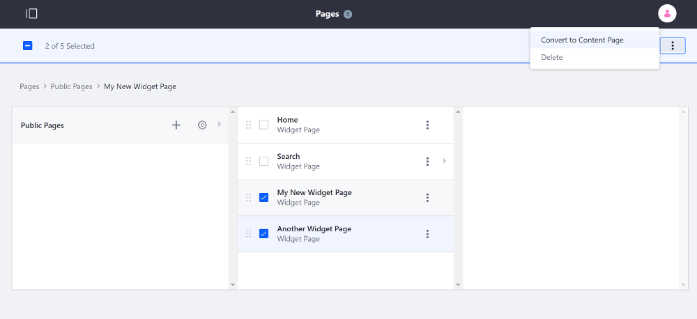

# Converting Widget Pages to Content Pages

In previous versions, Widget Pages provided exclusive features, such as custom layouts and customizable columns. Many of these exclusive features are available on Content Pages in 7.3, so in most cases, you'll want to create a Content Page.

If you're upgrading to Liferay Portal 7.3 from a previous version and migrating existing Widget Pages, you can convert them to Content Pages. You can convert a Widget Page to Content Page right away, or you can preview the conversion, make changes, and then convert the page.

If you have multiple pages you want to convert, you can bulk convert them through the Site Administration, or you can use the available APIs and built-in script editor to convert all Widget Pages at once. All approaches are described here.

## Preview and Convert a Widget Page to a Content Page

To preview a conversion draft before converting your Widget Page, follow these steps:

1. Open the Liferay DXP Menu and go to *Site Builder* &rarr; *Pages* under your Site's menu.

1. Open the Actions Menu () next to Widget Page and select the *Preview and convert to Content Page* option.

1. Acknowledge any warnings and make any required adjustments to the conversion draft. You can also add any Fragments you'd like to the draft at this point.

1. Click *Publish* to publish the preview draft, or click *Discard Conversion Draft* to reset the Widget Page back to its original state. If there are warnings, a best-effort conversion, as described below, is completed.

### Best Effort Conversions

Some features of Widget Pages aren't supported by Content Pages and therefore can't be converted exactly as they are. In these cases, the user is warned of any issues and a best-effort conversion is processed. These Widget Page features aren't supported:

* **Nested Applications:** Nested Applications are instead placed in the same column of the layout during the conversion. You may need to reorganize these applications after the best-effort conversion is complete.

* **Customizable Sections:** If the page is [customizable](./enabling-user-personalization-of-widget-pages.md), any customizations made by the user are lost during conversion.

* **Custom Page Layouts:** If the layout can be converted, the structure of the layout is conserved and the user is warned and given a chance to review the conversion draft before proceeding. If the layout can't be converted, all widgets are placed in a single row and column and you must manually reorganize them after the page is converted.

```note::
  If you've already confirmed that a custom layout template can be converted, You can disable the layout template conversion warning for the layout template so you don't keep seeing it each time you convert a Widget Page that uses the layout. Open the Liferay DXP Menu and go to *Control Panel* -> *Configuration* -> *System Settings*. Select *Pages* under Content and Data and add the layout template ID to the list of "Verified Layout Template IDs" under the System Scope.
```

```note::
  While portlets are rendered according to `render-weight <https://docs.liferay.com/dxp/portal/7.3-latest/definitions/liferay-portlet-app_7_3_0.dtd.html#render-weight>`_ on Widget Pages, that is not true for Content Pages. Portlets are rendered in the order they appear on the page on Content Pages (i.e. left to right, top to bottom), so you may notice some portlets are rendered sooner or later, depending on their placement on the Content Page.
```

## Converting Widget Pages Directly to Content Pages

Follow these steps to convert Widget Pages to Content Pages without a preview:

1. Open the Liferay DXP Menu and go to *Site Builder* &rarr; *Pages* under your Site's menu.

1. Check the box for the Widget Page, or multiple Widget Pages, and open the Actions Menu in the Management Toolbar and select the *Convert to Content Page* option.

   

1. Click *OK* in the prompt that appears to complete the conversion.

## Bulk Converting All Widget Pages to Content Pages with APIs

You can bulk convert all Widget Pages on a Site to Content Pages using the built-in script editor. Follow these steps:

1. Open the Liferay DXP Menu and go to *Control Panel* &rarr; *Configuration* &rarr; *Server Administration* &rarr; *Script*.

1. Enter this script in the script window, making sure to replace the Group ID with your own. The Groovy script uses the [`BulkLayoutConverter` interface](https://docs.liferay.com/dxp/portal/7.3-latest/apps/layout-3.0.0/javadocs/com/liferay/layout/util/BulkLayoutConverter.html) to convert all Widget Pages with the given Group ID to Content Pages:

    ```groovy
    import com.liferay.layout.util.BulkLayoutConverter
    import com.liferay.portal.kernel.util.ArrayUtil
    import com.liferay.registry.Registry
    import com.liferay.registry.RegistryUtil
    import org.osgi.framework.ServiceReference
    import org.osgi.framework.BundleContext

    Registry registry = RegistryUtil.getRegistry()

    BundleContext bundleContext = registry._bundleContext

    ServiceReference serviceReference = bundleContext.getServiceReference(BulkLayoutConverter.class.getName())

    BulkLayoutConverter bulkLayoutConverter = bundleContext.getService(serviceReference);

    long groupId = 20118L // Use your groupId

    long[] plids = bulkLayoutConverter.getConvertibleLayoutPlids(groupId)

    out.println("Convertible layouts before conversion:" + ArrayUtil.toStringArray(plids))

    long[] convertedLayoutPlids = bulkLayoutConverter.convertLayouts(groupId)

    out.println("Converted layouts:" + ArrayUtil.toStringArray(convertedLayoutPlids))

    plids = bulkLayoutConverter.getConvertibleLayoutPlids(groupId)

    out.println("Convertible layouts after conversion: " + ArrayUtil.toStringArray(plids))
    ```

1. Click *Execute* to run the script.

1. The output should look similar to the snippet below to show that no convertible layouts (pages) remain:

  ```bash
  Convertible layouts before conversion:[25, 26, 27]
  Converted layouts:[25, 26, 27]
  Convertible layouts after conversion: []
  ```