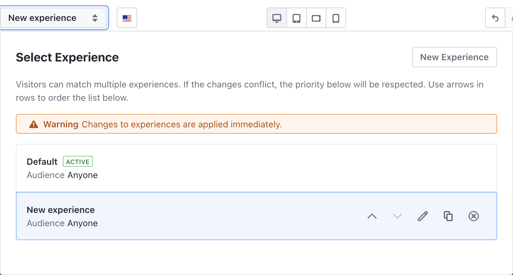
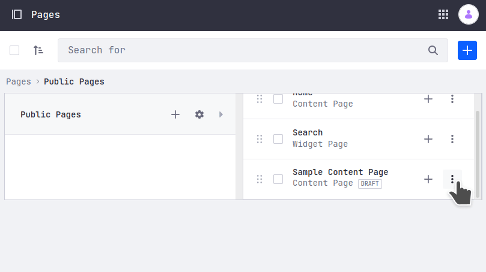

# Creating and Managing Experiences

> Some Experiences functionality is available in Liferay 7.4+, 7.3 Fix Pack 1+, and 7.2 Fix Pack 11+ only.

You can customize your Content Page to different groups of users using *Experiences*. To learn about Liferay DXP Experiences, see [Content Page Personalization](./content-page-personalization.md).

## Creating a New Content Page Experience

1. Go to *Site Administration* &rarr; *Site Builder* &rarr; *Pages*.
1. Click the Actions () menu and select *Edit*, or [create a new Content Page](../../creating-pages/building-and-managing-content-pages/building-content-pages.md).
1. At the top of the page, for the *Experience* click on *Default* to open the Experience selection dialog.

1. Click the Actions () menu and select *Edit*, or [create a new Content Page](../../creating-pages/adding-pages/adding-a-page-to-a-site.md).

1. At the top of the page, for the Experience click *Default* to open the Experience selection dialog.

    
1. Click *New Experience*.

1. Enter a name for the Experience and select the Segment for the audience you want to target, or [create a New Segment](../segmentation/creating-and-managing-user-segments.md) (available in Liferay DXP 7.2 Fix Pack 1+ and Liferay Portal 7.2 CE GA2+.)

    ```{note}
    New Experiences are assigned to the *Anyone* Segment by default and target all website visitors.
    ```

1. Edit your Content Page with the information and layout you want to show to the selected Segment.

1. Using the Up () and Down () controls, move the Experience in the list to set its precedence (see [Understanding How Experiences Work](./content-page-personalization.md#understanding-how-experiences-work) for more information).
1. Click *Publish*.

The Default version of the page appears for everyone except for members of the selected Segment, who see a version of the site for their defined Segment.

## Managing Content Page Experiences

When you edit a Content Page, you can click on the Experience to manage the options for that page.



1. Go to *Site Administration* &rarr; *Site Builder* &rarr; *Pages*.
1. Click the Actions () menu and select *Edit*.
1. Click on the Experience you want to manage. From here you can

   - Set the Experience Priority, using the Up () and Down () controls.
   - Edit () the Experience's name or the selected Segment.
   - Duplicate () the Experience (available in Liferay DXP 7.4+, 7.3 Fix Pack 1+, and 7.2 Fix Pack 11+.).
   - Delete () the Experience.

    ```{important}
    The order of your Experiences in the Experience selector determines the Experience precedence. See *Understanding How Experiences Work* in [Content Page Personalization](./content-page-personalization.md) for more information.
    ```    
 ## Switch Among Experiences from View and Preview Mode

 Switch from View to Preview mode helps you see the edits on your page before you publish it. You can make the list of experiences available from the view and preview mode, so not only users with edit permissions but also those with view permissions can see and review all experiences in a page. 

 When you preview a page pay attention to 3 main elements: 

 * Existing draft indicator &rarr; When you are logged in, made edits to a page and didn't publish it. The page name will include an *asterisk* icon as indicator.
 * Previewing draft label &rarr; When you are on view mode the page draft shows a *Draft* label.
 * Experience selector in view mode &rarr; In view mode there is an *Experience selector* next to the page name, so you can preview a page with any experience. This selector only appears if:
    * User is logged in.
    * User has permissions to edit the page.
    * The page has more than one experience.

In order switch among experiences from view to preview follow these steps:

1. Go to *Site Administration* &rarr; *Site Builder* &rarr; *Pages*.
1. Click the Actions () menu and select *Edit*.
1. At the top of the page, for the *Experience* click on *Default* to open the Experience selection dialog.
1. Click *New Experience*.
1. Enter a name for the Experience and select the Segment for the audience you want to target, or [create a New Segment](../segmentation/creating-and-managing-user-segments.md) (available in Liferay DXP 7.2 Fix Pack 1+ and Liferay Portal 7.2 CE GA2+.)
1. Edit your Content Page with the information and layout you want to show to the selected Segment and *don't publish it*.
1. To preview go to *Site Builder* &rarr; *Pages* &rarr; Click the Actions () menu and select *Preview Draft*.



## Related Information

- [Content Page Personalization](./content-page-personalization.md)
- [Personalizing Collections](./personalizing-collections.md)
- [Creating and Managing User Segments](../segmentation/creating-and-managing-user-segments.md)
