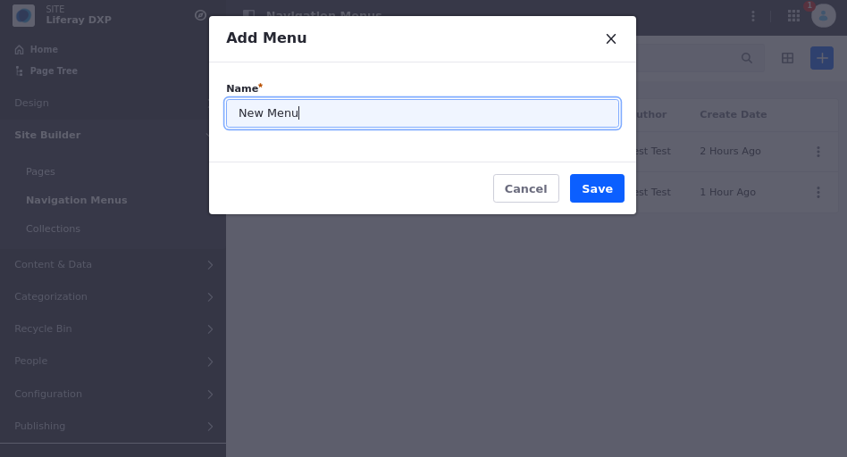
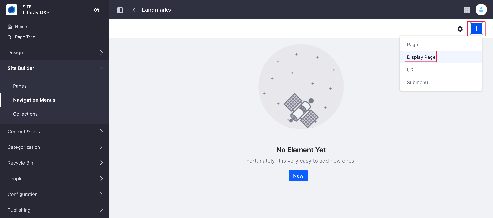
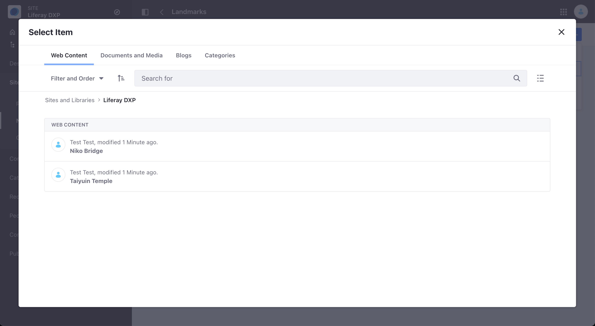
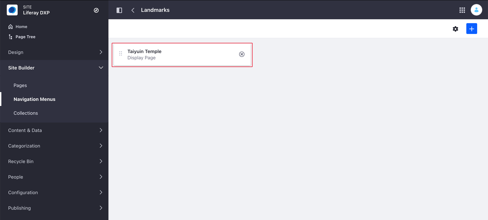
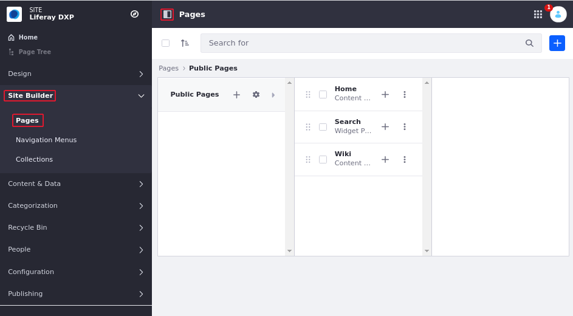
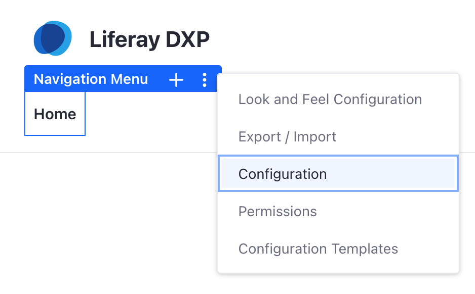
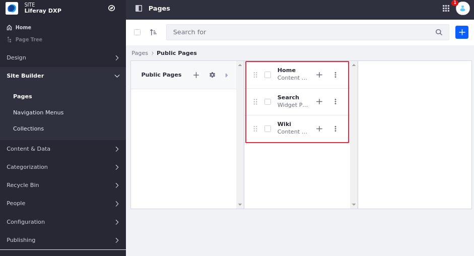
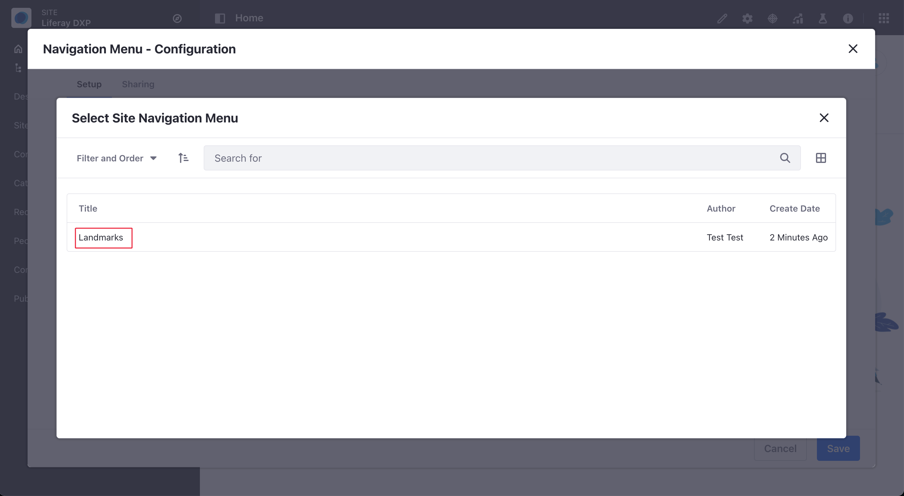

# Using Display Page as Navigation Menu Item and Page Link

You can now create a navigation menu item for a navigation menu that will point to the display page of a given item. This will allow to create menus with Pages and Display Pages for documents, webcontent, and blogs when they have a display page template associated types of items.

Getting started with Display Page as Navigation Menu Item and Page Links involves:

- [Using Display Page as Navigation Menu Item and Page Link](#using-display-page-as-navigation-menu-item-and-page-link)
  - [Creating Navigation Menus](#creating-navigation-menus)
  - [Adding a Navigation Menu Item to a Navigation Menu](#adding-a-navigation-menu-item-to-a-navigation-menu)
    - [Configure the Navigation Menu Widget](#configure-the-navigation-menu-widget)
  - [Additional Information](#additional-information)

## Creating Navigation Menus

1. Click _Product Menu_ () &rarr; _Site Builder_ &rarr; _Navigation Menus_.
1. Click the _Add_ button () to add a new menu.
1. Enter a name: (for example: _New Menu_).

    

1. Click _Save_ when finished.

The new navigation menu has been created.

##  Adding a Navigation Menu Item to a Navigation Menu

To add a Navigation Menu Item to a Navigation Menu, follow these steps:

1. Click the _Add_ button () &rarr; *Display Pages*.

    

1. Once you click on display page, a view to select the item that will be used will appear.
 
    

1. After you click on the item you want to select, a navigation menu item with the type “Display Page“ will be created.

    

### Configure the Navigation Menu Widget

Now you can configure the navigation menu widget to use the Landmarks Navigation Menu that you created.

1. Click _Product Menu_ () &rarr; _Site Builder_ &rarr; *Pages*
   
    
   
1. Click the () icon next to the desired *Navigation Menu*.
   
   

1. Select the Page you want.
   
   
   
1. Click *Choose Menu* &rarr; *Select*.

1. Select the Landmark you want to use.

    

1. Click _Save_ when finished.

The Navigation Menu has been Configured.

## Additional Information

* [Managing Site Navigation](./managing-site-navigation.md)
* [Configuring Navigation Menus](./configuring-navigation-menus.md)