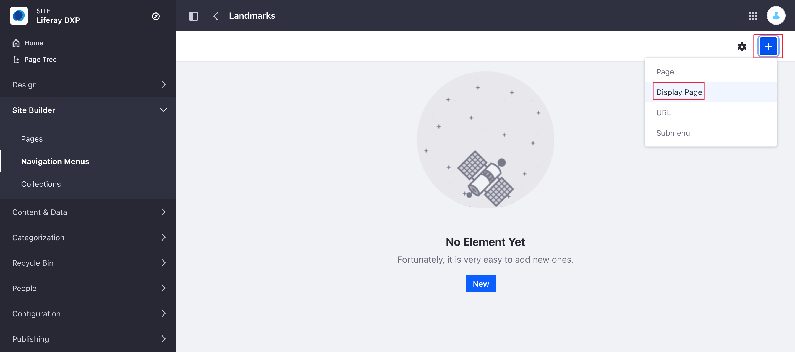
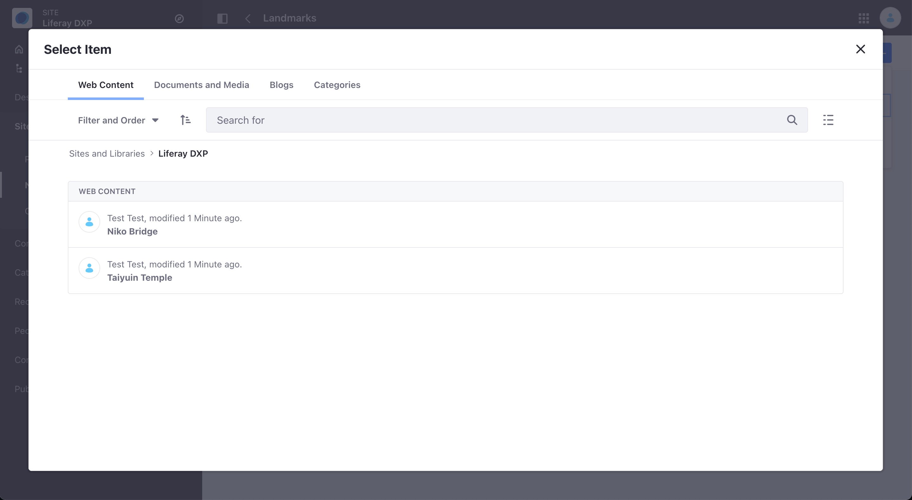
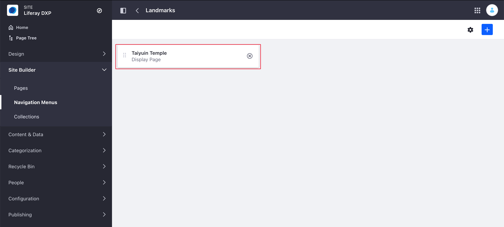
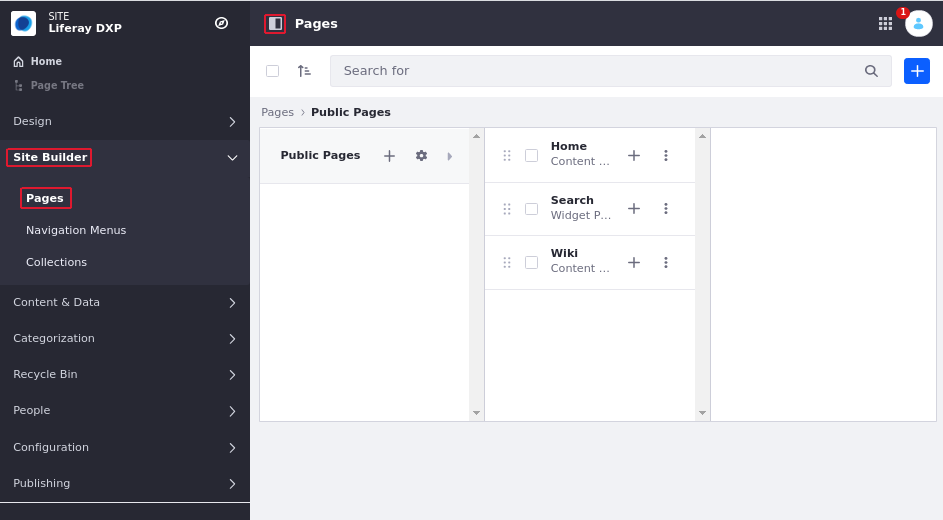
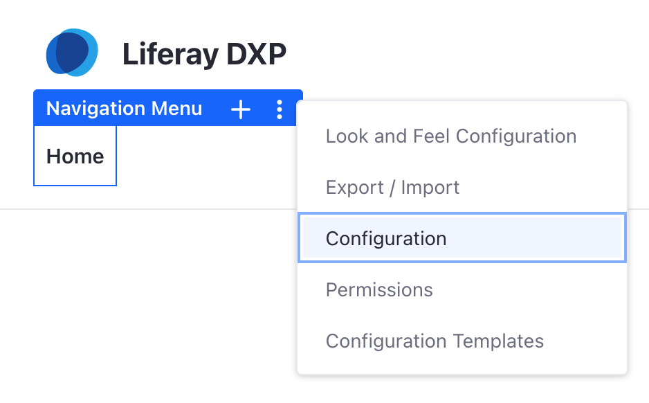
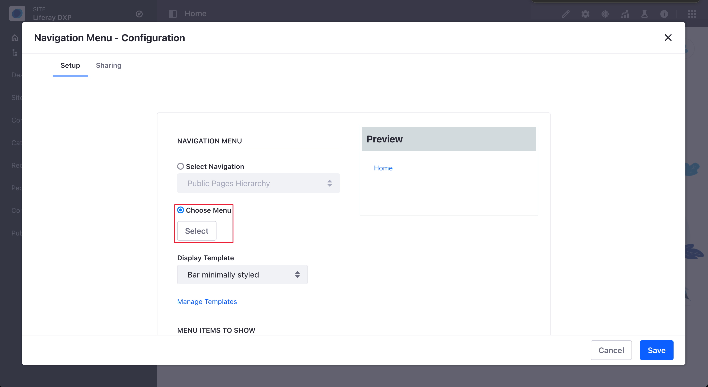
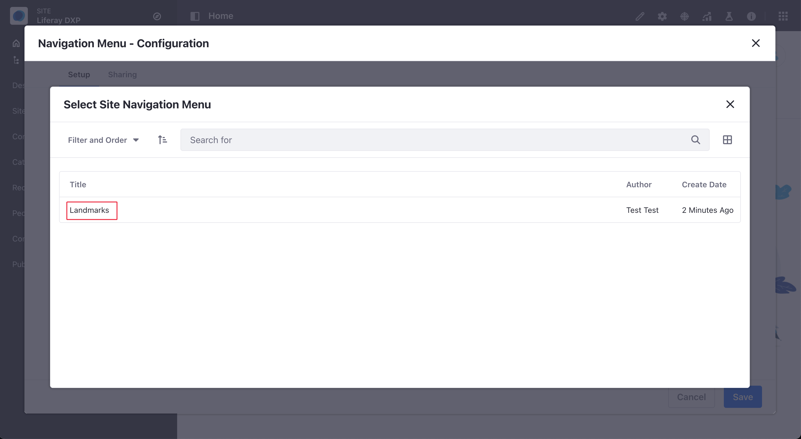

# Using a Display Page as Navigation Menu Item

> Available: Liferay DXP 7.4+

Starting with Liferay DXP 7.4, you can now create a Navigation Menu item for a [Navigation Menu](./using-navigation-menus.md) that points to a [Display Page](../displaying-content/using-display-page-templates/about-display-page-templates-and-display-pages.md). This allows you to create menus items linking to Documents, Web Content, Categories (starting with Liferay DXP 7.4+), and Blogs with an associated Display Page.

```{note}
Before adding a Display Page as a Navigation Menu item, you should [create a Navigation Menu](./using-using-navigation-menus.md#creating-navigation-menus).
```

## Adding a Display Page as a Navigation Menu Item

1. Click the _Add_ button () &rarr; *Display Page*.

    

1. On the Select Item window, select the tab for the type of content you want to add.

    

1. Under the tab, select the item you want to show in the Navigation Menu.

    

Adding a Display Page as a Navigation Menu item involves,

- [Creating a Navigation Menu](#creating-navigation-menus)
- [Adding a Navigation Menu item to the Navigation Menu](#adding-a-navigation-menu-item-to-a-navigation-menu)
- [Configuring the Navigation Menu Widget](#configuring-the-navigation-menu-widget)

## Configuring the Navigation Menu

Now you can configure the Navigation Menu to use your Display Page.

1. Click _Product Menu_ () &rarr; _Site Builder_ &rarr; *Pages*.

    

1. Open one of your Pages.
1. Hover over the Page Navigation Menu, click the () icon and Choose *Configuration*.

   

1. On the Navigation Menu configuration, click *Choose Menu* &rarr; *Select*.

    

1. Select the Navigation Menu you want to use.

    

1. Optionally, configure additional Navigation Menu options. For more information, read [Configuring Navigation Menus](./configuring-navigation-menus.md).
1. Click _Save_ and close the Configuration dialog.

## Additional Information

* [Managing Site Navigation](./managing-site-navigation.md)
* [Configuring Navigation Menus](./configuring-navigation-menus.md)
